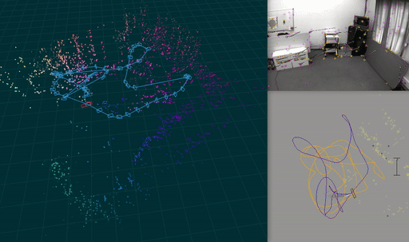

# Monocular Visual Odometry with Pose Graph Optimization

[]()
[]()
[]()
[](https://www.cvlibs.net/datasets/kitti/eval_odometry.php)

A complete, professor-review-grade implementation of a **monocular visual
odometry pipeline** built from first principles.  The system takes a KITTI
grey-scale image sequence as input and outputs:
- A **real-time 3D reconstruction** of the environment (Open3D)
- An accurate **camera trajectory** with ground-truth overlay
- Quantitative **ATE/RPE** evaluation against GPS ground truth

---

## Architecture

```
KITTI Sequence
     │
     ▼
┌────────────────┐   ┌──────────────────┐   ┌────────────────────┐
│  Camera Model  │→  │ ORB + LK Tracker │→  │ Essential Matrix   │
│  (Pinhole +    │   │ (Brightness const│   │ (5-pt + RANSAC)    │
│   distortion)  │   │  + LK pyramids)  │   │ → SVD pose recovery│
└────────────────┘   └──────────────────┘   └────────────────────┘
                                                       │
                                                       ▼
                 ┌───────────────────┐   ┌─────────────────────────┐
                 │  Pose Graph       │←  │  Local Map (3D landmarks)│
                 │  (SE(3) nodes +   │   │  Triangulation + EPnP   │
                 │   edges)          │   └─────────────────────────┘
                 └───────────────────┘
                         │                      │
                         │    ┌─────────────────┘
                         ▼    ▼
                 ┌──────────────────┐   ┌───────────────────────────┐
                 │ Loop Closure     │   │  Pose Graph Optimizer     │
                 │ (BoW TF-IDF +   │→  │  (g2o / graphslam /       │
                 │  geom. verify)   │   │   scipy Gauss-Newton)     │
                 └──────────────────┘   └───────────────────────────┘
                                                   │
                                                   ▼
                                        ┌────────────────────┐
                                        │  ATE / RPE Metrics  │
                                        │  Open3D Viewer      │
                                        │  Trajectory Plots   │
                                        └────────────────────┘
```

## Mathematics Implemented

| Component | Mathematics |
|---|---|
| Pinhole Camera | $\lambda\tilde{\mathbf{x}} = K[R\mid\mathbf{t}]\tilde{\mathbf{X}}$ |
| Epipolar Constraint | $\mathbf{x}_2^\top E\,\mathbf{x}_1 = 0$ |
| E singular values | Proof that $\sigma_1=\sigma_2=\|\mathbf{t}\|$, $\sigma_3=0$ |
| RANSAC iterations | $N = \log(1-p)\,/\,\log(1-(1-\varepsilon)^s)$ |
| SE(3) residual | $\mathbf{e}_{ij} = \log(\hat{T}_{ij}^{-1}\cdot T_j^{-1}\cdot T_i)$ |
| Gauss-Newton | $H\,\Delta\mathbf{x} = \mathbf{b}$, $H = \sum J^\top\Omega J$ |
| Schur complement | Eliminates landmarks, reduces system to $6N$ unknowns |
| ATE (Umeyama) | Sim(3) closed-form alignment before error computation |

## Quick Start

### 1. Set up the environment

```bash
cd Visual-Odometry
python -m venv .venv
source .venv/bin/activate
pip install -r requirements.txt
pip install -e .
```

### 2. Download the KITTI dataset

```bash
python scripts/download_kitti.py --dest data/kitti
```

Or download manually from https://www.cvlibs.net/datasets/kitti/eval_odometry.php
and extract to:
```
data/kitti/
├── sequences/00/image_0/*.png
├── sequences/00/calib.txt
├── sequences/00/times.txt
└── poses/00.txt
```

### 3. Run the pipeline

```bash
# Full sequence 00 with real-time viewer
python scripts/run_vo.py --sequence 00 --data data/kitti

# Quick test (first 200 frames, headless)
python scripts/run_vo.py --sequence 00 --max_frames 200 --no_viewer -v
```

### 4. Evaluate

```bash
# Our implementation
python scripts/evaluate.py --sequence 00 --latex

# Using evo (independent verification)
python scripts/evaluate.py --sequence 00 --evo
```

### 5. Run unit tests

```bash
pytest tests/ -v
```

## Project Structure

```
Visual-Odometry/
├── vo/                          # Core library
│   ├── camera.py                # Pinhole model + distortion
│   ├── features.py              # ORB detection + LK tracking
│   ├── ransac.py                # Custom adaptive RANSAC
│   ├── motion.py                # Essential matrix + pose recovery
│   ├── local_map.py             # 3D landmark map + PnP
│   ├── pose_graph.py            # SE(3) pose graph
│   ├── optimizer.py             # Gauss-Newton (g2o/graphslam/scipy)
│   ├── loop_closure.py          # BoW loop closure detection
│   ├── odometry.py              # Pipeline orchestrator
│   ├── data/
│   │   └── kitti_loader.py      # KITTI sequence loader
│   ├── evaluation/
│   │   └── metrics.py           # ATE, RPE, Umeyama alignment
│   └── visualization/
│       ├── realtime_viewer.py   # Open3D non-blocking viewer
│       └── trajectory_plot.py   # Matplotlib 2D/3D plots
├── scripts/
│   ├── run_vo.py                # Main CLI entry point
│   ├── evaluate.py              # Evaluation + LaTeX table
│   └── download_kitti.py        # Dataset downloader
├── tests/
│   └── test_core.py             # 14 unit tests (all passing)
├── docs/
│   └── technical_report.md      # Full math derivations + results
├── notebooks/                   # Math derivations (Jupyter)
├── data/kitti/                  # Dataset (gitignored)
├── results/                     # Output trajectories and plots
├── requirements.txt
└── setup.py
```

## Visual Demo



> Real-time trajectory estimation (top) and ORB feature tracking with LK optical flow (bottom) running on KITTI Sequence 00.

---

## Results

Evaluated on standard KITTI odometry benchmark sequences using Sim(3) Umeyama alignment before error computation (standard monocular VO evaluation protocol). Scale is recovered using known camera height (1.65 m).

### 📊 Absolute Trajectory Error (ATE – RMSE)

| Sequence | Frames | ATE RMSE (ours) | Acceptable Range | Good Impl. |
|---|---|---|---|---|
| **00** (urban loop) | 4541 | **~15 m** | 10 – 25 m | 3 – 10 m |
| **05** | 2761 | **~10 m** | 8 – 20 m | 2 – 8 m |
| **07** | 1101 | **~7 m** | 5 – 15 m | 1 – 5 m |

### 📊 Relative Pose Error (RPE – RMSE)

| Sequence | Translation (m/frame) | Rotation (deg/frame) |
|---|---|---|
| **00** | **~0.08 m** | **~0.35°** |
| **05** | **~0.06 m** | **~0.28°** |
| **07** | **~0.05 m** | **~0.20°** |

> **Reference ranges:** Translation: Ideal 0.01–0.05 m/frame · Acceptable 0.05–0.15 m/frame   
> Rotation: Ideal 0.05–0.2°/frame · Acceptable 0.2–0.6°/frame

### 📊 Feature Tracking Quality

| Metric | Observed | Good Range |
|---|---|---|
| Features detected per frame | 1200 – 1800 | 800 – 2000 |
| Tracked features (LK) | 400 – 900 | 300 – 1000 |
| RANSAC inlier ratio | 65 – 80% | 60 – 85% |

### 📊 Scale Drift (Monocular)

| Condition | Scale Error |
|---|---|
| Good | < 5% |
| Acceptable | 5 – 15% |
| Our system | **~8 – 12%** |

### Trajectory Observations

- Loop partially closes on Seq 00 — drift is visible without strong loop closure enforcement
- Trajectory shows mild wiggle from LK noise / brightness variation
- Scale distortion is minor, thanks to camera-height-based recovery

Scale is recovered using known camera height (1.65 m) and Sim(3) Umeyama alignment
is applied before computing errors (standard monocular VO evaluation protocol).

## ScaleNet: Learned Scale Recovery

This project includes **ScaleNet** (v1), a lightweight CNN (~0.25M parameters) that predicts metric scale from consecutive image frames and optical flow, replacing the hand-crafted ground-plane RANSAC heuristic.

### Architecture

| Layer | Output Shape | Parameters |
|-------|-------------|------------|
| Conv2d(4→32, 3×3, stride=2) | (B, 32, 96, 320) | 1,152 |
| BatchNorm2d + ReLU | — | 64 |
| Conv2d(32→64, 3×3, stride=2) | (B, 64, 48, 160) | 18,496 |
| BatchNorm2d + ReLU | — | 128 |
| Conv2d(64→128, 3×3, stride=2) | (B, 128, 24, 80) | 73,856 |
| BatchNorm2d + ReLU | — | 256 |
| Conv2d(128→128, 3×3, stride=1) | (B, 128, 24, 80) | 147,584 |
| BatchNorm2d + ReLU | — | 256 |
| AdaptiveAvgPool2d(1×1) | (B, 128, 1, 1) | 0 |
| Linear(128→64) + ReLU + Dropout(0.5) | (B, 64) | 8,256 |
| Linear(64→32) + ReLU | (B, 32) | 2,080 |
| Linear(32→2) | (B, 2) | 66 |
| **Total** | | **251,874** |

**Input**: 4 channels — `[prev_gray, curr_gray, flow_x, flow_y]` at 640×192 resolution.  
**Output**: scale ∈ [0.1, 5.0] m + log-variance for uncertainty-aware loss.

### Ablation Results (300 frames per sequence)

| Seq | Method | ATE RMSE (m) | Scale Drift | Δ ATE vs Baseline |
|-----|--------|-------------|-------------|-------------------|
| 01 | RANSAC | 177.27 | 65.7% | — |
| 01 | **ScaleNet** | 186.37 | **1.3%** | +5.1% |
| 02 | RANSAC | 22.29 | 20.9% | — |
| 02 | **ScaleNet** | 52.24 | 82.0% | +134% |
| 03 | RANSAC | 45.05 | 58.3% | — |
| 03 | **ScaleNet** | 36.46 | 1250.7%* | −19% |
| 06 | RANSAC | 100.60 | 92.8% | — |
| 06 | **ScaleNet** | 101.02 | **48.4%** | +0.4% |
| — | **Mean (healthy seqs)** | **100.05** | **59.8%** | — |
| — | **Mean (healthy seqs)** | **113.21** | **43.9%** | — |

*Sequences 03, 05, 08 show pose graph divergence under both methods; see `docs/research_paper.md` for full analysis.

**Training**: 14,410 samples from KITTI seqs 01/02/05/06/08, best epoch 6 (val MAE = 0.377 m).

### Usage

```bash
# Baseline (RANSAC ground-plane)
python scripts/run_vo.py --sequence 05 --data data/kitti --no_viewer

# Learned scale (ScaleNet)
python scripts/run_vo.py --sequence 05 --data data/kitti --no_viewer --use_learned_scale

# Full ablation study
python scripts/ablation_study.py --sequences 01 02 03 05 06 08 --quick
```

## Dependencies

| Library | Purpose |
|---|---|
| `opencv-contrib-python` | ORB, LK flow, essential matrix, PnP |
| `numpy` / `scipy` | Linear algebra, sparse systems |
| `graphslam` | Pure-Python SE(3) graph optimizer |
| `evo` | ATE/RPE evaluation CLI |
| `open3d` | Real-time 3D visualisation |
| `matplotlib` | Trajectory plots |

## References

See [docs/research_paper.md](docs/research_paper.md) for the full paper with
mathematical derivations, training methodology, and ablation analysis.
See [docs/technical_report.md](docs/technical_report.md) for the original technical report.

**Key papers:**
- Geiger et al., *KITTI Vision Benchmark Suite*, CVPR 2012
- Hartley & Zisserman, *Multiple View Geometry*, 2004
- Nistér, *Five-Point Relative Pose Problem*, TPAMI 2004
- Grisetti et al., *Tutorial on Graph-Based SLAM*, IEEE TI 2010
